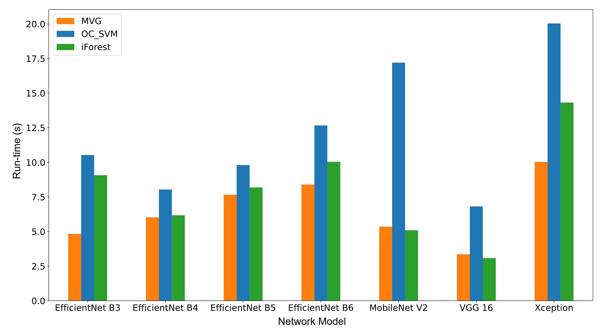

# Anomaly-detection-for-vision-based-obstacle-detection-in-automated-vehicles
This repository contains the source code accompanying the Master Thesis of Siddhant Shete with the title "Anomaly detection for vision-based obstacle detection in autonomous vehicles" presented at the Laboratory for Machine Tools and Production Engineering (WZL) at RWTH Aachen University.

The goal is the identification of obstacles in images using a deep hybrid anomaly detection (unsupervised learning) approach in which a deep neural network extracts high level features which are then classified using a conventional classification algorithm.


```1] Classifier Design- Multivariate Gaussian (MVG)```


```2] Classifier Design- One-Class SVM (OCSVM)```


```3] Classifier Design- Isolation Forest (iForest)```


*Installation*
```
python -m virtualenv .env           # Create virtualenv
source .env/bin/                    # Activate it
pip install -r requirements.txt     # Install the python dependencies

pip install -e .    # Install current directory as editable pip package
```

*To run the script for classification and calcualtion of metrics*
```
Run the file 
"newcodewzl_MVG.ipynb",  
"newcodewzl_OCSVM.ipynb"
"newcodewzl_Isolation_forest.ipynb"
```

*Metrics of detection*

```1] Area under the curve (AUC)```


```1] Runtime for per frame classification```

